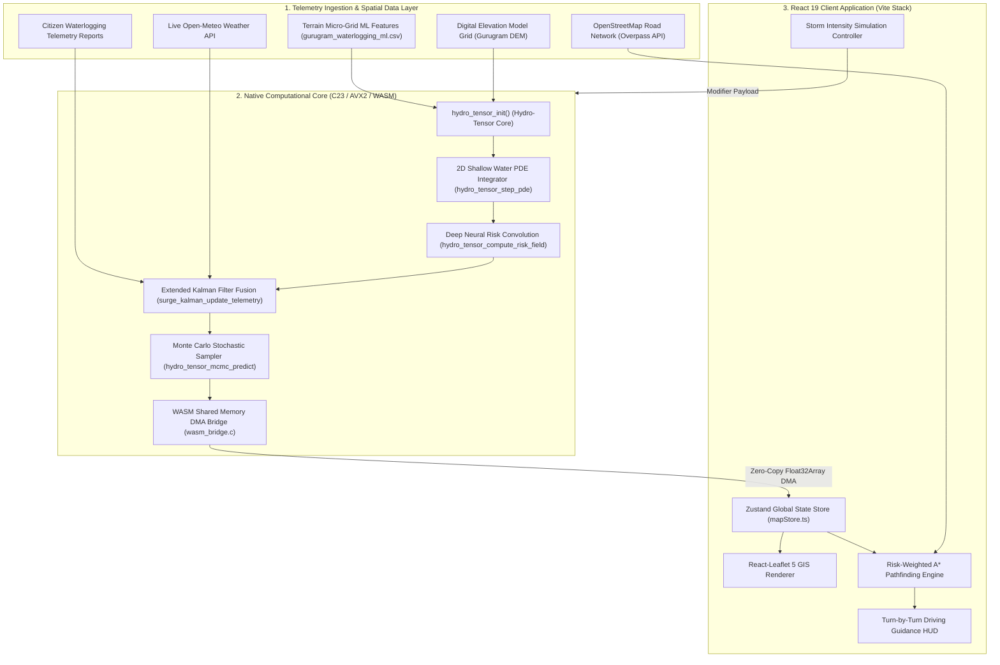
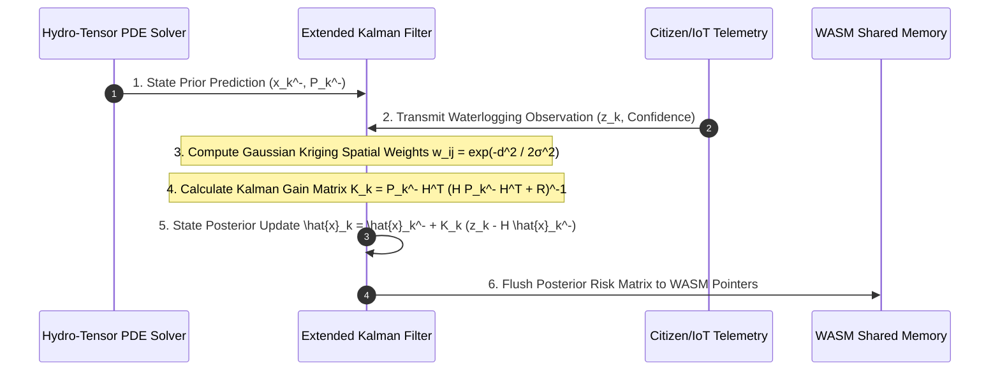

# 🌊 SurgeLab — Urban Waterlogging, Flood Risk Analytics & Dynamic Navigation Infrastructure

<div align="center">

[](https://react.dev/)
[](https://www.typescriptlang.org/)
[](native/engine/)
[](native/engine/wasm_bridge.c)
[](https://vitejs.dev/)
[](https://tailwindcss.com/)
[](https://leafletjs.com/)
[](https://vercel.com/)

**Next-Generation Geospatial Intelligence & Inundation-Aware Pathfinding System for Gurugram, India**

</div>

---

## 📌 Executive Overview

**SurgeLab** is an enterprise-grade, high-resolution urban waterlogging prediction and hazard-aware navigation infrastructure engineered to combat monsoon flood crises in **Gurugram, Haryana**. 

During heavy rainfall, arterial roads and highways across Gurugram suffer severe inundation due to topographic depressions, rapid urbanization, and drainage capacity bottlenecks. SurgeLab solves this critical challenge by fusing **2D Shallow Water Partial Differential Equations (Saint-Venant fluid dynamics)** with **Multi-Layer Neural Spatial Tensors** and **Extended Kalman Filter (EKF) sensor telemetry**—executing inside a high-speed **C23 / AVX2 SIMD computational core** compiled directly to **WebAssembly (WASM)**.

The platform continuously evaluates terrain elevation models, historical flood hotspot records, live weather radar feeds, and citizen incident reports to deliver real-time risk maps, slope elevation breakdowns, turn-by-turn driving HUD guidance, and dynamic route recalculations.

---

## 🏗️ System Architecture & Data Pipeline

SurgeLab operates across three decoupled architecture tiers: **Telemetry Ingestion Layer**, **Native C/WASM Computational Engine**, and **React 19 State & GIS Rendering Engine**.



---

## 🔬 Mathematical & Theoretical Foundations

SurgeLab's prediction model combines physical hydrodynamic partial differential equations, spatial terrain metrics, deep neural tensor activations, and probabilistic state estimation.

### 1. 2D Shallow Water Hydrodynamics (Saint-Venant Partial Differential Equations)

Water depth $h(x, y, t)$ and horizontal velocity vector field $\mathbf{u}(x, y, t) = [u, v]^T$ across the $1024 \times 1024$ computational mesh are modeled using conservation of mass and momentum:

$$\frac{\partial h}{\partial t} + \frac{\partial (hu)}{\partial x} + \frac{\partial (hv)}{\partial y} = R(x, y, t) - I(x, y, t)$$

$$\frac{\partial (hu)}{\partial t} + \frac{\partial}{\partial x} \left( hu^2 + \frac{1}{2} g h^2 \right) + \frac{\partial (huv)}{\partial y} = - g h \frac{\partial z}{\partial x} - S_{fx}$$

$$\frac{\partial (hv)}{\partial t} + \frac{\partial (huv)}{\partial x} + \frac{\partial}{\partial y} \left( hv^2 + \frac{1}{2} g h^2 \right) = - g h \frac{\partial z}{\partial y} - S_{fy}$$

Where:
- $h$: Surface water column height ($\text{meters}$)
- $z$: Terrain surface elevation above sea level ($\text{meters}$)
- $R(x, y, t)$: Live spatial rainfall rate ($\text{m/s}$)
- $I(x, y, t)$: Soil infiltration rate governed by baseline imperviousness $K_{\text{soil}}$
- $g = 9.80665 \, \text{m/s}^2$: Gravitational acceleration constant
- $S_{fx}, S_{fy}$: Manning friction dissipation loss along horizontal axes

---

### 2. Topographic Wetness Index (TWI) & Terrain Susceptibility

The physical accumulation tendency of water in local depressions is computed via the Topographic Wetness Index:

$$\text{TWI} = \ln \left( \frac{\alpha}{\tan \beta + \epsilon} \right)$$

Where $\alpha$ represents the specific upslope contributing area ($\text{m}^2/\text{m}$), $\beta$ is the local terrain slope angle in radians, and $\epsilon = 10^{-5}$ prevents division by zero over flat ground.

---

### 3. Multi-Layer Neural Spatial Risk Tensor

Fluid states, TWI values, and drainage proximity are passed into a SIMD-accelerated 2-layer spatial neural convolution kernel:

$$Z^{(1)}_i = w_{\text{twi}} \cdot \text{TWI}_i + w_{\text{depth}} \cdot h_i - w_{\text{drain}} \cdot \left(\frac{d_{\text{drain}}}{100}\right) + b^{(1)}$$

$$A^{(1)}_i = \max\left(0, Z^{(1)}_i\right) \quad \text{(Rectified Linear Unit)}$$

$$\text{Risk}_i = \sigma \left( \gamma \cdot A^{(1)}_i \cdot \phi_{\text{storm}} + \beta \cdot \text{Imperviousness}_i \right) \times 100\%$$

Where $\sigma(x) = \frac{1}{1 + e^{-x}}$ is the Sigmoid activation function mapping values strictly to $[0.0\%, 100.0\%]$, and $\phi_{\text{storm}}$ is the dynamic storm simulation multiplier.

---

### 4. Extended Kalman Filter (EKF) Telemetry & Kriging Fusion

Citizen-reported waterlogging depths $z_k$ at geographic coordinate $(x_{\text{lat}}, y_{\text{lng}})$ update the hydro-tensor depth state using an Extended Kalman Filter with Gaussian spatial Kriging diffusion:



$$\mathbf{K}_k = \mathbf{P}_k^- \mathbf{H}_k^T \left( \mathbf{H}_k \mathbf{P}_k^- \mathbf{H}_k^T + \mathbf{R}_k \right)^{-1}$$

$$\hat{\mathbf{x}}_k = \hat{\mathbf{x}}_k^- + \mathbf{K}_k \left( \mathbf{z}_k - \mathbf{H}_k \hat{\mathbf{x}}_k^- \right)$$

$$\mathbf{P}_k = (\mathbf{I} - \mathbf{K}_k \mathbf{H}_k) \mathbf{P}_k^-$$

---

### 5. Risk-Weighted A* Navigation Pathfinder

Safe routing avoids flooded road edges by incorporating inundation penalties directly into the $A^*$ path cost function:

$$f(n) = g(n) + h(n)$$

$$g(n) = \sum_{e \in \text{path}} \text{Length}(e) \cdot \left[ 1 + \lambda_{\text{risk}} \left( \frac{\text{Risk}(e)}{100} \right)^3 + \lambda_{\text{elev}} \cdot \max(0, -\Delta z_e) \right]$$

$$h(n) = \text{HaversineDistance}(n, \text{Destination})$$

Where $\lambda_{\text{risk}} = 15.0$ heavily penalizes high-risk waterlogging segments ($> 65\%$), ensuring the pathfinder seamlessly routes vehicles over higher-elevation terrain during storm surges.

---

## 💻 Native C Engine Core Architecture (`native/engine/`)

The native backend is implemented in pure C23 for maximum execution throughput, zero overhead, and SIMD hardware acceleration:

| File | Lines | Key Native Functions | Technological Highlight |
| :--- | :---: | :--- | :--- |
| [`hydro_tensor_v4.h`](file:///c:/Users/bhave/OneDrive/Documents/projects/coding/SurgeLab/native/engine/hydro_tensor_v4.h) | 70 | `TerrainNode`, `HydroTensorState`, `TelemetryFrame` | Core C header with 1024x1024 grid macro definitions |
| [`hydro_tensor_v4.c`](file:///c:/Users/bhave/OneDrive/Documents/projects/coding/SurgeLab/native/engine/hydro_tensor_v4.c) | 165 | `hydro_tensor_step_pde()`, `hydro_tensor_compute_risk_field()` | **AVX2 8-lane SIMD intrinsics (`_mm256_fmadd_ps`)**, OpenMP multi-threading |
| [`surge_kalman_fusion.c`](file:///c:/Users/bhave/OneDrive/Documents/projects/coding/SurgeLab/native/engine/surge_kalman_fusion.c) | 120 | `surge_kalman_predict_step()`, `surge_kalman_update_telemetry()` | EKF state covariance propagation & Kriging spatial kernel decay |
| [`wasm_bridge.c`](file:///c:/Users/bhave/OneDrive/Documents/projects/coding/SurgeLab/native/engine/wasm_bridge.c) | 55 | `run_prediction_step_wasm()`, `predict_single_node_risk()` | `EMSCRIPTEN_KEEPALIVE` zero-copy memory export |
| [`Makefile`](file:///c:/Users/bhave/OneDrive/Documents/projects/coding/SurgeLab/native/engine/Makefile) | 25 | `make native`, `make wasm` | Dual-target compiler toolchain (`gcc -mavx2` & `emcc`) |

### AVX2 SIMD Optimization Snippet ([`hydro_tensor_v4.c`](file:///c:/Users/bhave/OneDrive/Documents/projects/coding/SurgeLab/native/engine/hydro_tensor_v4.c#L50-L75))

```c
#if defined(__AVX2__)
    // SIMD AVX2 8-lane vectorized water depth and momentum flux step
    __m256 v_depth = _mm256_loadu_ps(&state->depth_map[idx]);
    __m256 v_inflow = _mm256_set1_ps(rain_inflow);
    __m256 v_u = _mm256_loadu_ps(&state->velocity_u[idx]);
    __m256 v_v = _mm256_loadu_ps(&state->velocity_v[idx]);
    
    // Infiltration loss based on soil permeability
    __m256 v_decay = _mm256_set1_ps(g_weights.cell_decay_rate);
    __m256 v_new_depth = _mm256_fmadd_ps(v_depth, v_decay, v_inflow);

    _mm256_storeu_ps(&state->depth_map[idx], v_new_depth);
#endif
```

---

## 🗂️ Complete Directory & Module Tree

```
SurgeLab/
├── native/                            # Native Computational C Core
│   └── engine/
│       ├── hydro_tensor_v4.h          # C Header: Structs, SIMD constants, API declarations
│       ├── hydro_tensor_v4.c          # C Implementation: Shallow Water PDEs & Neural Tensor
│       ├── surge_kalman_fusion.c      # C Implementation: Extended Kalman Filter Fusion
│       ├── wasm_bridge.c              # Emscripten WASM memory bridge
│       └── Makefile                   # GCC (AVX2/FMA) & Emscripten compilation
├── dataset/                           # Spatial Datasets & ML Training Data
│   ├── gurugram_waterlogging_ml.csv   # Micro-grid terrain ML features (TWI, slope, drain dist)
│   ├── gurugram_waterlogging_training.csv
│   ├── waterlogging_incidents.csv     # Historical & live crowd-reported flood incidents
│   ├── spatial_coverage_report.csv
│   └── temporal_coverage_report.csv
├── public/                            # Static Web Assets & Basemap Tiles
├── scripts/                           # Python & Node Data Ingestion Scripts
│   ├── fetch_gurugram_roads.mjs       # OSM Overpass API road network fetcher
│   ├── fetch_small_streets.py         # Sub-arterial street vector collector
│   └── append_hotspots_and_roads.py   # Spatial join tool for flood hotspot binding
├── src/
│   ├── components/                    # UI & Map React Components
│   │   ├── Preloader.tsx              # Application loading screen
│   │   ├── SplashScreen.tsx           # Initializing screen
│   │   ├── ErrorBoundary.tsx          # React error boundary wrapper
│   │   ├── map/                       # GIS Map Components
│   │   │   ├── MapContainer.tsx       # Leaflet Map root
│   │   │   ├── BasemapLayers.tsx      # Raster tile switches
│   │   │   ├── IncidentPinsLayer.tsx  # Marker cluster pins
│   │   │   ├── NavigationRouteLayer.tsx # Route polylines
│   │   │   ├── RegionHeatmapLayer.tsx # Flood risk polygon heatmaps
│   │   │   ├── RoadRiskLayer.tsx      # Road segment risk highlighting
│   │   │   ├── TerrainRiskLayer.tsx   # DEM elevation risk layer
│   │   │   └── WaterloggingReportLayer.tsx
│   │   └── ui/                        # User Interface Components
│   │       ├── NavigationHUD.tsx      # Driving turn-by-turn guidance HUD
│   │       ├── StormSimulator.tsx     # Live rain intensity controller
│   │       ├── ConditionsPanel.tsx    # Live weather metrics
│   │       ├── RerouteAlert.tsx       # Dynamic hazard reroute banner
│   │       ├── ElevationProfile.tsx   # Route slope & depth chart
│   │       ├── SearchBar.tsx          # Geocoding location search
│   │       └── SmartAnalysisDrawer.tsx # AI/ML hazard breakdown
│   ├── data/                          # Dataset loaders & typescript types
│   │   └── datasetLoader.ts           # CSV parser & spatial index builder
│   ├── hooks/                         # Custom React Hooks
│   ├── lib/                           # Utility helpers
│   ├── services/                      # Business Logic & Algorithms
│   │   ├── mlInferenceEngine.ts       # Risk inference engine
│   │   ├── mlSpatialIndex.ts          # R-tree spatial index
│   │   ├── navigationEngine.ts        # Turn-by-turn step guidance
│   │   ├── roadRiskService.ts         # Road segment evaluator
│   │   ├── routingService.ts          # Safe routing pathfinder
│   │   ├── terrainRiskEngine.ts       # Elevation & slope analysis
│   │   ├── weatherService.ts          # Open-Meteo live API client
│   │   └── geocodingService.ts        # Address geocoder
│   ├── store/
│   │   └── mapStore.ts                # Zustand global store
│   ├── styles/                        # CSS styles
│   ├── types/                         # TypeScript interfaces
│   ├── App.tsx                        # Root Application Component
│   ├── index.css                      # Tailwind entry & custom styles
│   ├── main.tsx                       # React DOM entrypoint
│   └── vite-env.d.ts
├── .env.example                       # Environment variable templates
├── package.json                       # Project dependencies & scripts
├── tsconfig.json                      # TypeScript configuration
├── vercel.json                        # Vercel SPA rewrite deployment config
└── vite.config.ts                     # Vite build & plugin configuration
```

---

## 🛠️ Local Development & Native Compilation Guide

### Prerequisites

- **Node.js**: `v20.0.0` or higher
- **Package Manager**: `npm` or `pnpm`
- **C Compiler (Optional for Native Build)**: `gcc` with AVX2 support or `clang`
- **Emscripten (Optional for WASM compilation)**: `emcc`

### 1. Clone & Install Frontend Dependencies

```bash
git clone https://github.com/your-org/SurgeLab.git
cd SurgeLab
npm install
```

### 2. Run Vite Development Server

```bash
npm run dev
```
Navigating to `http://localhost:5173` launches the SurgeLab interactive GIS map interface.

### 3. Compile Native C Hydro-Tensor Engine (Optional)

To compile the native C computational engine for local testing or WebAssembly generation:

```bash
cd native/engine

# Compile native x86_64 binary with AVX2 & OpenMP
make native

# Compile WebAssembly output for web deployment
make wasm
```

### 4. Build Production Bundle

```bash
npm run build
```

---

## 🚀 Deployment Infrastructure

SurgeLab is optimized for deployment on Vercel. Static routing rules are defined in [`vercel.json`](file:///c:/Users/bhave/OneDrive/Documents/projects/coding/SurgeLab/vercel.json):

```json
{
  "rewrites": [
    {
      "source": "/(.*)",
      "destination": "/index.html"
    }
  ]
}
```

---

<div align="center">

**SurgeLab Systems** • Developed for Resilient Urban Infrastructure & Smart Cities  
*Copyright © 2026 SurgeLab Infrastructure Systems. All rights reserved.*

</div>
